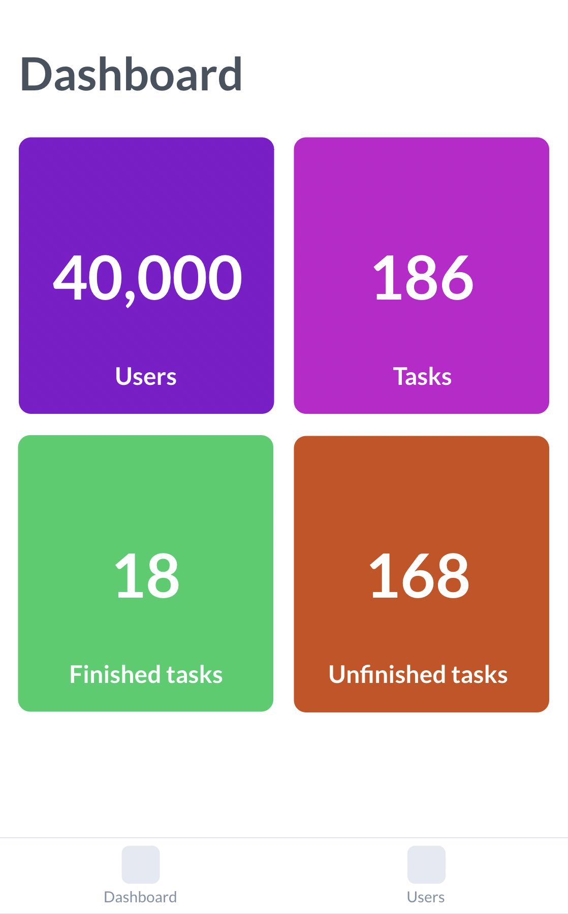
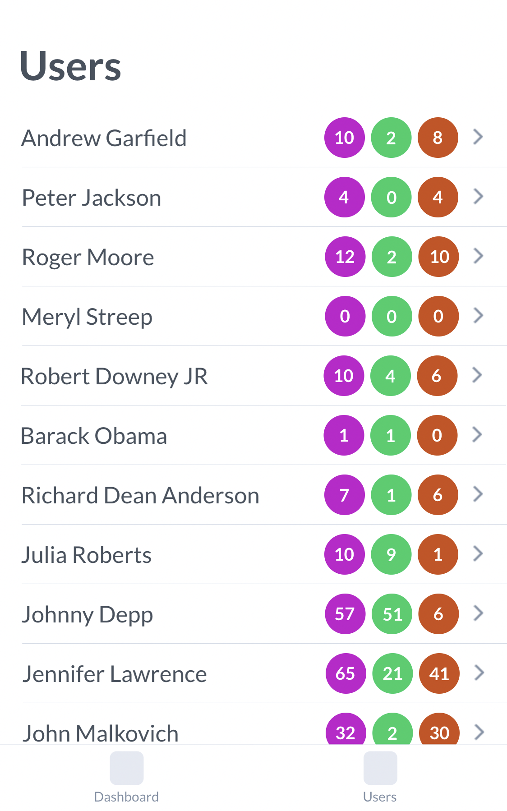
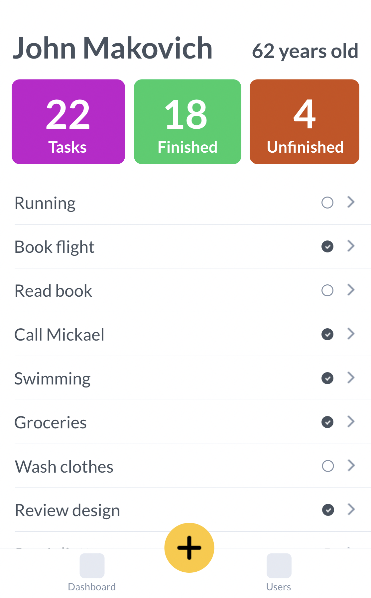
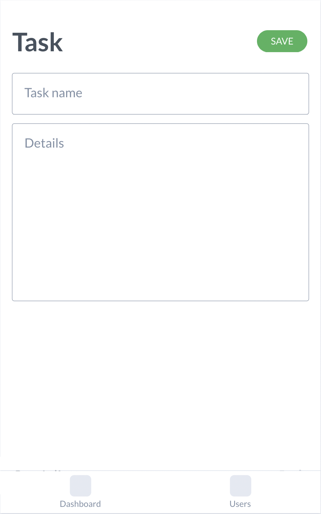

# WELFAIRE - Frontend Engineer Test

## Requirements

- `NodeJS` - `v16`
- `npm`
- `Angular CLI` - `v14`

## Introduction

This test will focus on a set of skills used at Welfaire, to do so, you will have to create a todo-list application with Angular 14.

This application will be composed of the following pages:
- Dashboard
- List of users
- User todo list
- Add / edit task

You will have access to an API in NodeJS that will return the list of users.

It is important that your project respects Angular and HTML best practices. Imagine that this project must go into production, so it must be of impeccable quality.

## Todo list

### View

For the dimensions of the screen, it will be necessary to activate the `Developer Tools` of `Chromium` and choose the mobile display `iPhone 12 Pro`.

### Dashboard

The dashboard part will be composed of the following information:
- Total number of users
- Total number of tasks
- Number of unfinished tasks
- Total number of completed tasks



### List of users

The user list will have to be fed by the 100 000 users entries of the API. 

The number of DOM elements in the page should never exceed `300`. It will be possible to have an overview of the total number of tasks, completed and unfinished for each user.

Each user should be visible in this list, without pagination.



### User todo list

Each user will have the following information:
- Name
- Age
- Total number of tasks
- Number of unfinished tasks
- Total number of completed tasks
- Tasks



### Add / edit task

Each task will be editable or addable at any time will have the following fields:
- Name
- Description
- Status



## API

### Start API

In order to launch the API, you will need to run this command.

```bash
$ npm run server
```

### Access the API

The API will be accessible at the following url `http://localhost:3000/api/users`

### Pagination

The url parameters are:
- `page`: the page number
- `pageSize`: the number of items per page

If the parameters are not defined, the following values will be set:

- `page`: 1
- `pageSize`: 10

## Storage

For the subject of the persistence of the tasks of the todo list, it will have to pass by the `StorageService`.

## Style

It is essential to use TailwindCSS for Angular components.

### Colors

- Violet: `#8313CE`
- Pink: `#C40FCD`
- Green: `#11CC65`
- Orange: `#C74A10`
- Yellow: `#FFC72B`

See [documentation](https://tailwindcss.com/).

## Angular Application

### Development server

Run `ng serve` for a dev server. Navigate to `http://localhost:4200/`. The application will automatically reload if you change any of the source files.

### Code scaffolding

Run `ng generate component component-name` to generate a new component. You can also use `ng generate directive|pipe|service|class|guard|interface|enum|module`.

### Build

Run `ng build` to build the project. The build artifacts will be stored in the `dist/` directory.